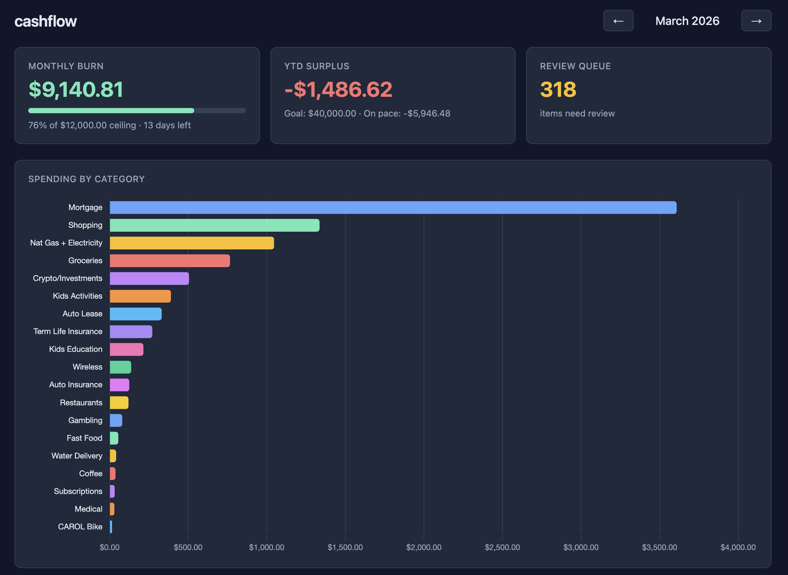

# cashflow

A highly opinionated household financial dashboard. Not trying to be Mint. Not trying to support every bank ever created.

The premise: most personal finance tools fail at the data layer — they either require you to connect bank accounts through a third-party aggregator (Plaid, Yodlee) that can break, get deprecated, or get acquired, or they expect you to manually categorize hundreds of transactions in a clunky web UI.

This tool takes a different approach. It targets users who want to **streamline their finances around a small set of banks and credit cards that have good CSV exports and data hygiene** — Chase, BofA, Apple Card, Target — and builds a durable, local-first pipeline on top of them. You own your data. Nothing phones home. The database is a single SQLite file on your machine.

The secondary insight: Amazon is the biggest black box in household spending. A single Chase line item like "AMAZON MKTPL*B80X61JB1 $44.52" tells you nothing. This tool cracks it by reconciling order numbers to actual product names — so you know if that $44 was supplements, kids clothes, or a kitchen gadget.

**On budgeting philosophy:** This tool deliberately rejects the "6 jars / sinking funds for everything" approach to household budgeting. Rigidly pre-allocating every dollar — $400 for vacation, $200 for car repairs, $150 for Christmas — sounds disciplined but is exhausting to maintain and breaks down the moment life doesn't follow the spreadsheet.

Instead, cashflow is built around a simpler mental model: target **60-80% of monthly take-home on structured spending** (mortgage, utilities, recurring bills, investments, groceries) and let the remaining slack absorb the fun stuff — vacations, big purchases, birthday dinners, the random $500 Amazon order that turns out to be a NAS build. Track your annual surplus target as a single number. If you're on pace, you're fine. If you're not, the dashboard shows you exactly where the money went.

The goal isn't perfection. It's visibility.

Built in a weekend to replace a manual spreadsheet. Now handles 2,800+ transactions across 7 card formats with LLM categorization that learns from corrections.



## What it does

- **Ingests** transactions from Chase, BofA, Target, Capital One, Citi/Costco, Apple Card, and Amazon orders
- **Reconciles** Amazon line items to Chase transactions via order numbers — so "AMAZON MKTPL*B80X61JB1" becomes "Seagate IronWolf Pro 12TB"
- **Categorizes** with a rules engine + LLM fallback that learns from corrections
- **Tracks** monthly burn rate against a spending ceiling and YTD surplus against an annual goal
- **Serves** a local dashboard your whole household can view in a browser

## Quick start

```bash
pip install -e ".[dev]"

# Ingest your statements
cashflow ingest --files ~/Downloads/chase-prime-2026.csv
cashflow ingest --files ~/Downloads/amazon-orders.txt

# See where you stand
cashflow status

# Open the dashboard
cashflow dashboard
```

## Supported data sources

| Source | Format | Notes |
|--------|--------|-------|
| Chase (Prime Visa, Freedom) | CSV | Order numbers embedded → Amazon reconciliation |
| Bank of America (credit cards) | CSV | Two cards, sign-flipped |
| Bank of America (checking) | CSV | Detects paycheck deposits as income |
| Target RedCard | CSV | Uppercase `.CSV` extension |
| Apple Card | CSV | Has cardholder name (per-person tracking) |
| Citi/Costco | Screen scrape | Per-person tracking |
| Capital One | Screen scrape | Year inferred from statement boundaries |
| Amazon orders | Screen scrape | Item-level reconciliation with Chase |

Drop files in `~/cashflow/inbox/` or pass them directly to `cashflow ingest --files`.

## CLI commands

```bash
# Ingestion
cashflow ingest --files PATH          # Process CSVs and order scrapes
cashflow ingest --auto                # Email polling (future)

# Status
cashflow status                       # Burn rate + YTD surplus snapshot

# Review & categorize
cashflow review                       # Interactive review queue
cashflow rule list                    # Show all merchant rules
cashflow rule set "ALLY" "Auto Lease" # Create/update a rule + recategorize
cashflow rule add-category "Auto Lease" n  # Add new category (n=necessity, w=want)
cashflow rule apply                   # Re-run all rules on pending transactions

# Search
cashflow find "marriott"                    # search by merchant or description
cashflow find "kroger" --year 2025          # filter by year
cashflow find "amazon" --limit 5            # show fewer results

# Tagging
cashflow find "luvansh"                     # get the transaction ID first
cashflow tag 1234 --one-off "Diamond bracelet - wife Xmas gift"

# Dashboard
cashflow dashboard                    # Opens http://localhost:8080
cashflow dashboard --port 9090        # Custom port
```

## Dashboard

The local dashboard (`cashflow dashboard`) serves a Chart.js frontend showing:

- Monthly burn rate vs spending ceiling with color-coded progress bar
- YTD surplus vs annual goal with pace projection
- Spending by category (horizontal bar chart, auto-sized)
- Monthly trend — spending vs income across the year
- Transaction table with sorting, merchant, category, and who paid

Month navigation updates all views including the burn rate card.

## Setup

### Environment variables

```bash
# Required for LLM categorization
export CASHFLOW_LLM_KEY="your-api-key"

# Optional — defaults to Anthropic API
export CASHFLOW_LLM_URL="https://api.anthropic.com/v1/messages"
export CASHFLOW_LLM_MODEL="claude-sonnet-4-5-20250929"
```

See `.env.example` for a template.

### Dependencies

```bash
pip install -e ".[dev]"
```

Python 3.12+, FastAPI, uvicorn, httpx, Click, Chart.js (CDN).

## Categorization

Transactions are categorized in three stages:

1. **Merchant rules** — substring match, deterministic, instant. `cashflow rule set "Kroger" "Groceries"` applies immediately and recategorizes all matching transactions.
2. **LLM fallback** — unmatched transactions sent to Claude with your full category list. High confidence (≥90%) auto-confirms; low confidence queues for review.
3. **Learning loop** — every correction during `cashflow review` creates a persistent rule so the same merchant never needs review again.

## Architecture

```
cashflow.db (SQLite, ~/.cashflow/)
    ├── transactions     (2,800+ rows)
    ├── amazon_items     (84+ items, linked by order number)
    ├── income           (paycheck deposits)
    ├── categories       (seeded from 2025 budget)
    ├── merchant_rules   (grows with corrections)
    └── goals            (monthly ceiling, annual surplus)

CLI (Click) → parsers → SQLite ← FastAPI → browser dashboard
```

The database lives in `~/.cashflow/cashflow.db` — outside the repo, never committed.

## Running tests

```bash
python -m pytest tests/ -v
```

136 tests across parsers, ingestion, categorization, API endpoints, and CLI commands.

## What's next

- [ ] Email channel — Gmail API polling of dedicated finance inbox
- [ ] Amazon EML parser — 1,000+ order confirmation emails with per-item prices
- [ ] `cashflow ask` — natural language queries against SQLite ("how much did we spend on kids activities vs last year?")
- [ ] `cashflow briefing` — weekly push summary to both partners
- [ ] LAN sync — rsync to always-on server for household dashboard access
- [ ] Local model support — point `CASHFLOW_LLM_URL` at a vLLM or Ollama endpoint running a local open-weight model (Llama 3, Mistral, Qwen) for fully offline categorization. The OpenAI-compatible chat completions interface is already used, so any local server that speaks that protocol works without code changes.
- [ ] Drill-down categories — click any bar in the spending chart to expand it inline into sub-categories. "Shopping $2,400" stays clean at the top level, but clicking reveals Electronics $636 (NAS drives), Kids Clothing $132 (Target receipt), Supplements $187 (Amazon Subscribe & Save), etc. Depends on Amazon EML parser and Target email receipts for item-level data. The category hierarchy (`parent_id`) is already in the DB schema.
