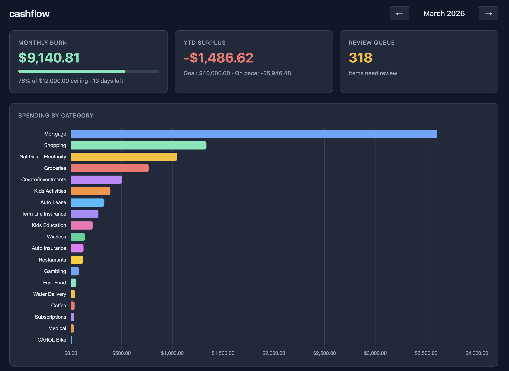

# cashflow

A highly opinionated household financial dashboard. Not trying to be Mint. Not trying to support every bank ever created.

The premise: most personal finance tools fail at the data layer — they either require you to connect bank accounts through a third-party aggregator (Plaid, Yodlee) that can break, get deprecated, or get acquired, or they expect you to manually categorize hundreds of transactions in a clunky web UI.

This tool takes a different approach. It targets users who want to **streamline their finances around a small set of banks and credit cards that have good CSV exports and data hygiene** — Chase, BofA, Apple Card, Target — and builds a durable, local-first pipeline on top of them. You own your data. The database is a single SQLite file on your machine. Configured LLM categorization sends merchant, description, and amount to that endpoint; leave `CASHFLOW_LLM_URL` unset for rules/manual categorization only. Charts load Chart.js from a CDN; cards and transactions still work if it is unavailable.

The secondary insight: Amazon is the biggest black box in household spending. A single Chase line item like "AMAZON MKTPL*B80X61JB1 $44.52" tells you nothing. This tool stores Amazon order details and links items when a transaction contains the same full order number and there is one eligible charge. Ordinary Amazon merchant reference codes are not order numbers. Linked item names are not yet displayed or categorized by the dashboard.

**On budgeting philosophy:** This tool deliberately rejects the "6 jars / sinking funds for everything" approach to household budgeting. Rigidly pre-allocating every dollar — $400 for vacation, $200 for car repairs, $150 for Christmas — sounds disciplined but is exhausting to maintain and breaks down the moment life doesn't follow the spreadsheet.

Instead, cashflow is built around a simpler mental model: target **60-80% of monthly take-home on structured spending** (mortgage, utilities, recurring bills, investments, groceries) and let the remaining slack absorb the fun stuff — vacations, big purchases, birthday dinners, the random $500 Amazon order that turns out to be a NAS build. Track your annual surplus target as a single number. If you're on pace, you're fine. If you're not, the dashboard shows you exactly where the money went.

The goal isn't perfection. It's visibility.

Built in a weekend to replace a manual spreadsheet. Supports the household's bank exports with merchant rules, optional LLM categorization, and manual corrections.



## What it does

- **Ingests** transactions from Chase, BofA, Target, Capital One, Citi/Costco, Apple Card, and Amazon orders
- **Links** Amazon items to a unique positive transaction with a matching full order number; split shipments remain unresolved
- **Categorizes** with a rules engine + LLM fallback that learns from corrections
- **Tracks** monthly burn rate against a spending ceiling and YTD surplus against an annual goal
- **Serves** a dashboard on localhost, with one-off and reimbursement controls

## Quick start

```bash
pip install -e ".[dev]"

# Ingest your statements
cashflow ingest --files ~/Downloads/chase-prime-2026.csv
cashflow ingest --files ~/Downloads/amazon-orders.txt

# See where you stand
cashflow status

# Open the dashboard
cashflow dashboard
```

## Supported data sources

| Source | Format | Notes |
|--------|--------|-------|
| Chase Prime Visa / Freedom | CSV | Include `freedom` in Freedom filenames; other Chase exports map to Prime Visa |
| Bank of America (credit cards) | CSV | Cards share one account bucket; export each physical account separately |
| Bank of America (checking) | CSV | Detects paycheck deposits as income |
| Target RedCard | CSV | Uppercase `.CSV` extension |
| Apple Card | CSV | Has cardholder name (per-person tracking) |
| Amex Gold | CSV | Per-person tracking via Card Member field |
| Robinhood Gold Card | CSV | Posted transactions only; refunds retained; payments/rewards redemptions excluded |
| Citi/Costco | Screen scrape | Per-person tracking |
| Capital One (Venture + Wendy) | CSV export | Card number → who attribution (fred/wife) |
| Amazon orders | Screen scrape | Item-level reconciliation with Chase |
| Wells Fargo | CSV | Purchases and refunds; automatic card payments excluded |
| PayPal | CSV | Debit transactions only; limited support, not a complete PayPal balance/refund ledger |
| Expense reports | .xlsx | Matches to existing transactions by date + amount |

Drop exports in `~/cashflow/inbox/` and run `cashflow ingest --auto`, or pass a file/directory to `cashflow ingest --files PATH`. CSV headers select the parser; filenames do not need bank keywords. Text scrapes still need `amazon` or `citi` in the filename. Chase Freedom exports need `freedom` in the filename; other Chase CSVs map to Prime Visa. Capital One Wendy exports need `wendy` in the filename to select that account. Unknown formats fail visibly. Reimporting an unchanged export skips existing source IDs; identity collisions with different details stop the import for reconciliation.

## CLI commands

```bash
# Ingestion
cashflow ingest --files PATH          # Process CSVs and order scrapes
cashflow ingest --auto                # Import local ~/cashflow/inbox/ exports

# Status
cashflow status                       # Burn rate + YTD surplus snapshot
cashflow daily-note                   # Same numbers + audit alarms into today's clearwater daily note

# Review & categorize
cashflow review                       # Interactive review queue
cashflow rule list                    # Show all merchant rules
cashflow rule set "ALLY" "Auto Lease" # Create/update a rule + recategorize
cashflow rule add-category "Auto Lease" n  # Add new category (n=necessity, w=want)
cashflow rule apply                   # Re-run all rules on pending transactions

# Search
cashflow find "marriott"                    # search by merchant or description
cashflow find "kroger" --year 2025          # filter by year
cashflow find "barber" --date-from 2026-01-01 --date-to 2026-06-30  # date range
cashflow find "barber" --min-amount 20 --max-amount 60 --who fred  # amount and person
cashflow find "amazon" --account venture --json   # machine-readable output
cashflow dupes                               # likely duplicate charges (cross-source pairs)
cashflow dupes --json                        # cross-account pairs as JSON
cashflow dupes --all                         # include same-account identical repeats
cashflow dedupe-link 2817 3157               # mark 3157 a duplicate of 2817 (stops counting)
cashflow dedupe-link --from-dupes            # preview + bulk-link pairs from `dupes`
cashflow dedupe-unlink 3157                  # undo a link

# Tagging & recategorizing
cashflow find "luvansh"                     # get the transaction ID first
cashflow tag 1234 --one-off "Diamond bracelet - wife Xmas gift"
cashflow recategorize 2432 "Consumer Electronics"  # override category for one txn

# Expense reports (reimbursements)
cashflow ingest --expense-report ~/Downloads/expense-reports-2025/
cashflow ingest --expense-report ~/Downloads/core_week.xlsx  # single file

# Account freshness & annual fees
cashflow freshness                           # how stale is each account's data?
cashflow fees                                # recognized annual fees + estimated renewals

# Dashboard
cashflow dashboard                    # Opens http://localhost:8080
cashflow dashboard --port 9090        # Custom port
```

## Dashboard

The local dashboard (`cashflow dashboard`) serves a Chart.js frontend showing:

- Monthly burn rate vs spending ceiling with color-coded progress bar
- YTD surplus vs annual goal with pace projection
- Spending by category (horizontal bar chart, auto-sized)
- Monthly trend — spending vs income across the year
- Transaction table with sorting, merchant, category, and who paid

Month navigation updates all views including the burn rate card.

## Setup

### Environment variables

```bash
# Required for LLM categorization
export CASHFLOW_LLM_KEY="your-api-key"
export CASHFLOW_LLM_KEY_HEADER="x-api-key"
export CASHFLOW_LLM_URL="https://api.anthropic.com/v1/messages"
export CASHFLOW_LLM_MODEL="claude-sonnet-4-5-20250929"
```

See `.env.example` for provider templates. `.env` is not automatically loaded: export the variables in your shell. LLM categorization runs during an import that inserts records when the endpoint is configured; otherwise unmatched records remain available for manual review.

### Dependencies

```bash
pip install -e ".[dev]"
```

Python 3.12+, FastAPI, uvicorn, httpx, Click, openpyxl, Chart.js (CDN).

## Categorization

Transactions are categorized in three stages:

1. **Merchant rules** — literal substring match, longest pattern first; equal lengths favor the newest rule. `cashflow rule set "Kroger" "Groceries"` applies immediately and recategorizes all matching transactions.
2. **LLM fallback** — unmatched transactions sent to Claude with your full category list. High confidence (≥90%) auto-confirms; low confidence queues for review.
3. **Learning loop** — every correction during `cashflow review` creates a persistent rule so the same merchant never needs review again.

## Architecture

```
cashflow.db (SQLite, ~/.cashflow/)
    ├── transactions     (charges, refunds, reimbursement offsets)
    ├── amazon_items     (order details, optionally linked by order number)
    ├── income           (paycheck deposits)
    ├── categories       (seeded from 2025 budget)
    ├── merchant_rules   (grows with corrections)
    └── goals            (monthly ceiling, annual surplus)

CLI (Click) → parsers → SQLite ← FastAPI → browser dashboard
```

The database lives in `~/.cashflow/cashflow.db` — outside the repo, never committed.

## Querying the data

- **Direct SQL** — [docs/adhoc-queries.md](docs/adhoc-queries.md) documents the schema, amount/dedup semantics, and copy-paste recipes for common questions (merchant searches, category trends, subscription audits). Open the DB read-only with `sqlite3 -readonly ~/.cashflow/cashflow.db`.
- **HTTP API** — [docs/api.md](docs/api.md) documents the dashboard server's endpoints (`/api/status`, `/api/monthly/{y}/{m}`, `/api/transactions`, `/api/yearly/{y}`, and the one-off/reimbursement toggles); OpenAPI docs are served at `/docs` while the server runs.
- **CLI** — `cashflow find "merchant" [--date-from YYYY-MM-DD] [--date-to YYYY-MM-DD] [--min-amount N] [--max-amount N] [--who fred|wife|shared] [--account NAME] [--year YYYY] [--json]` for ad hoc questions; `cashflow dupes` lists possible duplicate charges; `cashflow status` for the burn-rate snapshot. Every SQL recipe in docs/adhoc-queries.md is validated against the schema by `tests/test_docs_sql.py`.

See [data preservation and recovery](docs/data-preservation.md) for the verified NAS backup, snapshot procedure, restore steps, and planned offsite protection.

## Running tests

```bash
python -m pytest tests/ -v
```

Tests cover parsers, storage, ingestion, matching, categorization, API endpoints, CLI commands, and dashboard JavaScript behavior. Install Node to run the JavaScript tests; they report skips if it is absent. Tests use temporary databases. Never ingest test fixtures into your personal database.

## What's next

- [ ] Email channel — Gmail API polling of dedicated finance inbox
- [ ] Amazon EML parser — 1,000+ order confirmation emails with per-item prices
- [ ] `cashflow ask` — natural language queries against SQLite ("how much did we spend on kids activities vs last year?")
- [ ] `cashflow briefing` — weekly push summary to both partners
- [ ] LAN access — requires an access-control design and consistent SQLite backups before synchronization; the current server binds to localhost
- [ ] Local model support — point `CASHFLOW_LLM_URL` at a vLLM or Ollama endpoint running a local open-weight model (Llama 3, Mistral, Qwen) for fully offline categorization. The OpenAI-compatible chat completions interface is already used, so any local server that speaks that protocol works without code changes.
- [x] Monthly trend: Total / Baseline / One-offs. Baseline excludes tagged one-offs, retains refunds, and subtracts reimbursements. A grouped annual review by one-off label remains future work.
- [ ] Drill-down categories — click any bar in the spending chart to expand it inline into sub-categories. "Shopping $2,400" stays clean at the top level, but clicking reveals Electronics $636 (NAS drives), Kids Clothing $132 (Target receipt), Supplements $187 (Amazon Subscribe & Save), etc. Depends on Amazon EML parser and Target email receipts for item-level data. The category hierarchy (`parent_id`) is already in the DB schema.

## Data quality and catch-up

Start with [the household sync guide](docs/household-sync.md). Latest transaction dates indicate observed activity, not verified statement coverage. Checking income is stored separately and currently recognizes the configured Spotify paycheck pattern only. Other deposits, transfers, and checking refunds need manual reconciliation; the app is not a bank-balance or net-worth ledger.

Repeated identical exports are deduplicated by source ID. Equal amounts, dates, or merchant names are not sufficient evidence to hide a checking payment. Chase and Robinhood preserve multiple identical purchases within an export using occurrence suffixes. Exports without bank transaction IDs can still contain indistinguishable repeated purchases; reconcile statement totals and use complete date ranges rather than partial selections of same-day rows. BofA cards and checking accounts are currently aggregated, so freshness cannot prove that each underlying account is current.

Expense reports match only a unique date/amount candidate (exact day, otherwise a seven-day window). Ambiguous matches stay unresolved; approval in an expense report is not proof that reimbursement cash arrived. PayPal matching also remains heuristic. Verify matches before using them for a household settlement.

Code fixes do not repair historical records automatically. See [audit findings and reconciliation notes](docs/2026-09-23-audit.md). Older files under `docs/superpowers/` are design/history, not current operating instructions.
